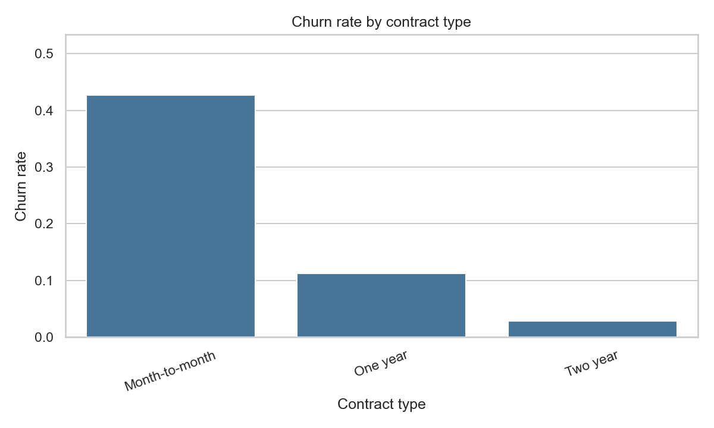
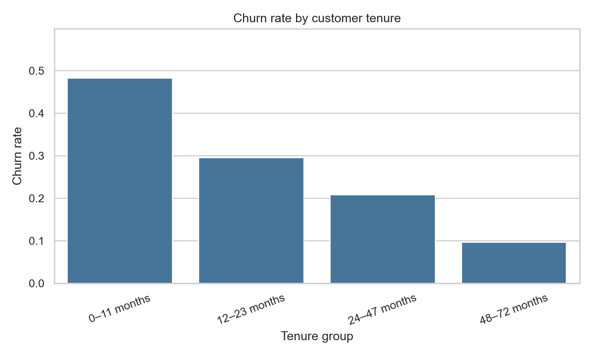
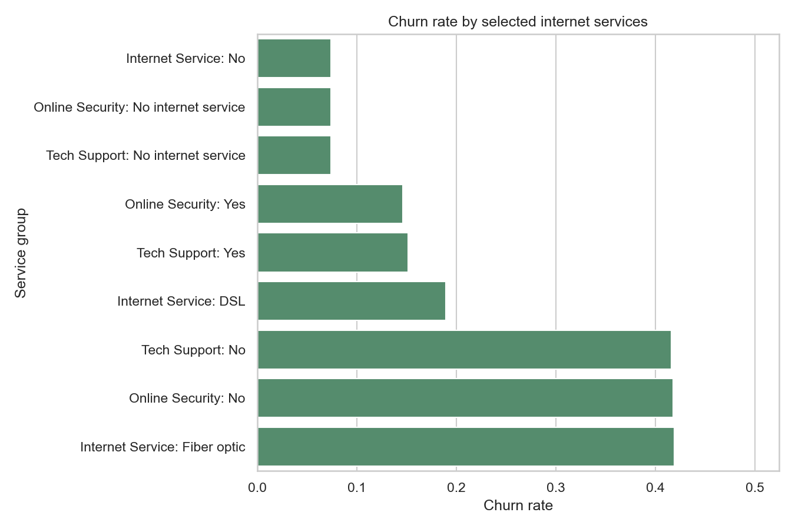

# Customer Churn Analysis

A reproducible customer analytics project that examines which contract, tenure, service, payment, and demographic groups have different observed churn rates in IBM's Telco Customer Churn sample. It uses Python and Pandas for cleaning and analysis, PostgreSQL SQL for parallel segment queries, and a small set of business-focused charts.

**This is descriptive analysis, not a causal study or a production churn model.**

## Business Questions

- What share of customers in the sample churned?
- How does the observed churn rate vary by contract, tenure, monthly-charge group, payment method, selected services, and demographics?
- Which contract and tenure groups have higher observed churn rates?
- What customer characteristics are common among churned customers?
- What data and study limitations prevent causal conclusions?

## Dataset and Source

- **Dataset:** IBM Telco Customer Churn sample, one customer per row, 7,043 rows and 21 columns in the pinned source file.
- **Original source repository:** [IBM/telco-customer-churn-on-icp4d](https://github.com/IBM/telco-customer-churn-on-icp4d).
- **Exact version:** source repository commit [d5371f5d83a446ad5673cbcca3b814b926491f8a](https://github.com/IBM/telco-customer-churn-on-icp4d/tree/d5371f5d83a446ad5673cbcca3b814b926491f8a); the downloader also checks SHA-256 16320c9c1ec72448db59aa0a26a0b95401046bef5d02fd3aeb906448e3055e91.
- **Direct CSV:** [pinned Telco-Customer-Churn.csv](https://raw.githubusercontent.com/IBM/telco-customer-churn-on-icp4d/d5371f5d83a446ad5673cbcca3b814b926491f8a/data/Telco-Customer-Churn.csv).
- **Context:** IBM describes the sample as a fictional telco and the churn field as customers who departed within the last month. See [IBM's Telco customer churn sample documentation](https://www.ibm.com/docs/en/cognos-analytics/12.1.x?topic=samples-telco-customer-churn).
- **License:** IBM's repository licenses its *code pattern* under Apache-2.0 but does not give the CSV a separate data-specific license in the repository documentation. This project does not redistribute the CSV: it is downloaded to an ignored local folder. Review the source repository's terms before reusing or redistributing the data. Project code is MIT licensed; that license does not apply to the dataset.

The source includes customer demographics, tenure, service selections, contract, paperless billing, payment method, monthly and total charge fields, and a churn label. The charge fields do not state a currency in the CSV, so results and charts use source units without assigning a currency.

## Key Findings

The following values are generated from the pinned CSV by python -m src.pipeline. The churn rate for each group is churned customers divided by all customers in that group.

- **7,043** customers; **1,869** churned and **5,174** retained; overall churn rate **26.54%**.
- Month-to-month customers had a **42.71%** churn rate (**1,655 of 3,875**); one-year customers **11.27%** (**166 of 1,473**); two-year customers **2.83%** (**48 of 1,695**).
- Customers with **0–11 months** tenure had a **48.28%** churn rate (**999 of 2,069**), compared with **9.64%** (**222 of 2,303**) for 48–72 months.
- The Electronic check group had a **45.29%** churn rate (**1,071 of 2,365**). This is an observed association; payment choice may be related to other customer or service characteristics.
- Customers with Fiber optic internet had a **41.89%** churn rate (**1,297 of 3,096**); customers with no internet service had **7.40%** (**113 of 1,526**).
- The median tenure was **29 months**. Median monthly charge was **70.35 source units**; the CSV does not label the currency.

The groups overlap and the rates do not show that contract, tenure, payment method, or service choice caused churn. Run `python -m src.pipeline` to generate full counts and category results in `outputs/tables/`. Only the compact summary and quality JSON reports are tracked in Git; the category CSVs are generated locally.

## Visualisations

These are generated directly from the pinned dataset:

The pipeline also saves churn distribution, payment-method churn, monthly-charge distribution by churn label, and tenure-distribution charts. The corresponding tables include contract, tenure, monthly-charge, payment, service, demographic, and churned-customer summaries.

## Project Architecture

    Pinned IBM CSV (downloaded locally; excluded from Git)
                    |
                    v
          Python cleaning and quality audit
                    |
           +--------+---------+
           v                  v
      Pandas analysis     Clean customer CSV
           |                  |
           +-- tables/charts  v
           +------------> PostgreSQL table
                                |
                                v
                      PostgreSQL SQL analysis

## Data Cleaning

src/data_cleaning.py records row counts, duplicate counts, missing values, invalid numeric values, and churn-label counts in outputs/tables/data_quality_report.json.

- Customer IDs are read as strings; whitespace is removed from IDs and categorical labels.
- Yes/No fields become booleans; the SeniorCitizen source field is checked for 0/1 values.
- Tenure and charge fields are parsed as numeric. Negative charges, tenure outside 0–72, invalid values, or missing required tenure/monthly-charge values cause validation errors rather than silent row deletion.
- The 11 blank TotalCharges entries are retained as missing. They are not imputed or used as a reason to drop customers.
- Exact duplicate rows are removed. Conflicting duplicate customer IDs stop the pipeline for review.
- Churn must normalize to Yes or No. Unrecognized labels fail validation.

The observed source has no exact duplicate records, 11 missing TotalCharges values, and no missing customer IDs, churn labels, tenure, or monthly charges. The pipeline retains all **7,043** customer rows.

## Analysis and Segments

src/analysis.py writes overall KPIs, churn-by-category tables, a numeric customer profile by churn status, and a table of common characteristics among churned customers. Segment tables always include customer counts, churn counts, and rates. The contract-by-tenure ranking excludes groups below 30 customers to keep very small groups from dominating the display; this threshold is not a significance test.

Tenure groups are 0–11, 12–23, 24–47, and 48–72 months. Monthly-charge groups use 0–<30, 30–<60, 60–<90, and 90+ source units. src/visualisation.py creates a small set of labeled Matplotlib/Seaborn charts. There is no machine-learning model: the project focuses on descriptive data analysis and does not claim predictive performance.

## PostgreSQL SQL

sql/schema.sql defines a single customer-grain table. sql/churn_analysis.sql includes overall churn counts and rate, contract, tenure, monthly-charge, service, payment and demographic comparisons, and a RANK() over contract/tenure segments. The input is a single denormalized customer file, so a dimensional join is not needed for these queries.

The rate denominator and segment bands match Python. The SQL is PostgreSQL-compatible and parsed by pglast in the tests; **it has not been executed against a live PostgreSQL server**.

To load the cleaned CSV into a local PostgreSQL database, run:

    psql "$DATABASE_URL" -f sql/schema.sql
    psql "$DATABASE_URL"

Then, in the psql prompt:

    \copy churn_analysis.customers FROM 'data/processed/customers_clean.csv' WITH (FORMAT csv, HEADER true, NULL '')
    \q

Run the analysis:

    psql "$DATABASE_URL" -f sql/churn_analysis.sql

## Technology and Skills

- Python, Pandas, NumPy
- PostgreSQL DDL and SQL aggregates, filters, CASE, CTEs, and a window function
- Exploratory analysis, customer segmentation, missing-value and duplicate handling
- Matplotlib and Seaborn data visualisation
- pytest unit tests and pglast SQL syntax checks
- Jupyter notebooks for exploration and analysis

## Run and Reproduce

Python 3.9 or newer is supported. The source is downloaded automatically if the ignored raw CSV is absent; the downloader pins the Git commit and validates the file checksum.

    python3 -m venv .venv
    source .venv/bin/activate
    python -m pip install -r requirements.txt
    python -m src.pipeline
    python -m pytest

The pipeline writes:

- data/processed/customers_clean.csv
- outputs/tables/churn_summary.json and category/profile CSV tables
- outputs/tables/data_quality_report.json
- PNG charts under outputs/charts/

The raw CSV and generated customer-level CSV are excluded from Git. The compact summary reports and three representative aggregate charts are tracked. To explore the notebooks, run jupyter lab from the project directory and open the two files in notebooks/.

GitHub Actions installs the declared dependencies and runs pytest, including SQL parsing. It does not require a database server.

## Limitations

- This is an IBM fictional sample, not real customer behavior or a representative telecom population.
- Churn is a label for recent departure in the sample, while many feature values are account snapshots; the data does not support causal or production-retention claims.
- Contract, tenure, charges, service selections, payment method, and demographics may be interrelated. These summaries do not adjust for confounding.
- The CSV does not label the currency for its charge fields.
- SQL syntax and definitions are tested, but a live PostgreSQL execution was not available for this run.
- No Power BI dashboard or predictive model is included.

## Future Improvements

- Run the SQL against a local PostgreSQL instance and add a controlled database integration test.
- Add confidence intervals or a clearly scoped statistical association analysis.
- If a suitable data license is established, document it and add an optional model baseline with leakage controls.
- Add a Power BI report only after building and validating the report itself.

## License

Project code is MIT licensed. The IBM source repository describes the Apache-2.0 license as applying to its code pattern; the dataset license is not separately stated there. The raw dataset is not committed to this project.

